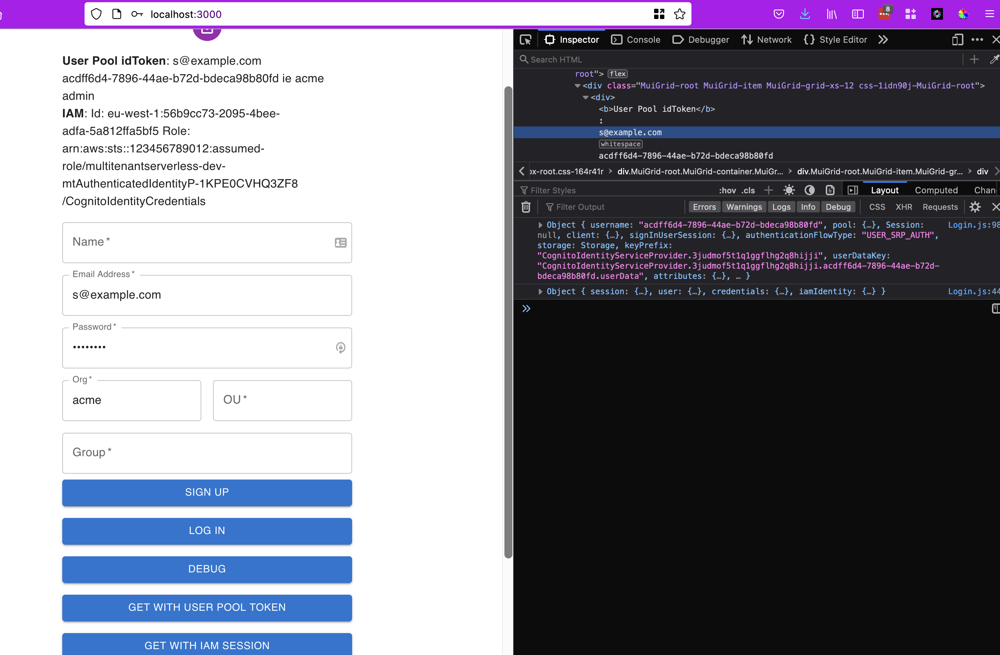

# multitenantserverless

This is a sample application demonstrating authentication and multi-tenanted access control with Amazon Cognito.

It includes:

1. API Gateway endpoints with multiple authorizer configurations
2. A custom Lambda authorizer to enforce scoped-down access control for isolated tenants using shared storage infrastructure
3. A front-end application for signup, authentication and API invocation

## Getting started

The root directory contains the serverless application stack. The frontend application is found in the [mtfrontend](./mtfrontend/) subfolder.

From the root directory, build and deploy the serverless application as follows:
```
npm install
serverless deploy
```

To start the frontend application, switch to `mtfrontend` and run the local development server:

```
cd mtfrontend
npm install
npm start
```

The UI is now available at http://localhost:3000.

## Walkthrough

The serverless stack contains Cognito resources and APIs. In a normal deployment, these might be separated into different stacks.

### User Pool
The Cognito User Pool is the identity store for users and groups. The configuration here ([serverless.yml](./serverless.yml))
provides:

1. The user pool itself
2. A single group called `admin`
3. Custom attributes for the organisation id (`org`) and org unit (`ou`). These attributes are marked as _multable_ so a user's organisation tenancy can be altered.
4. A user pool client with for user in the web application. This enables SRP authentication support (username and password authentication) and also ensure that the client application cannot mutate the `org` and `ou` attributes.

With this user pool configuration, signup, login, reset password and logout are all possible.

### Identity Pool
The Identity Pool is configured with the User Pool as its _Authentication Provider_. This allows a client to exchange a user pool token for IAM credentials. This identity pool configuration only provides an _authenticated role_. It's possible to extend this with an unauthenticated role or with multiple roles, with the role being selected by rules based on the user's attributes.

### Authorizers

The AWS IAM authorizer is built-in, so we don't need to create any resources to support it. There are two other authorization types used; the custom Lambda authorizer and the Cognito User Pool authorizer. The user pool authorizer is simply linked to the user pool. It cannot provide any finer-grained access control than a Yes/No result.

The custom Lambda authorizer ([authorizer.py](./authorizer.py)) checks the group and `org` values for the authenticated user. It dynamically constructs an IAM policy to restrict access based on the user's role and organisation. _STS AssumeRole_ is invoked to assume a base role with this _scoped-down_ policy. The returned temporary credentials are then passed to the Lambda function backing the API. This function can then use the temporary credentials instead of the Lambda's own execution policy to access data in the shared storage.

### APIs

A number of APIs are provided to test each authorization method. These are:

1. `GET /thing_iam`:  Uses an IAM authorizer 
2. `GET /thing_pool`: Uses the Cognito User Pool authorizer
3. `GET /thing_custom`: Uses the tenant-isolating custom Lambda authorizer
4. `PUT /user-group`: Updates the user's group membership or tenancy. This uses the Cognito User Pool authorizer which will grant access to user administration if the authenticated use is a member of the `admin` groups.

The three `thing` APIs are all backed by the same function code which attempts to access DynamoDB data for each of the three hardcoded organisation IDs (`acme`, `tinycorp`, `bigcorp`). The function also echoes back the event data.

## Using the Front End

The UI provides signup, login and API invocation all in one form.

- Signup requires the user to be 'validated' in Cognito. Since we have no email validation flow built in, the user can be manually validated in the Cognito User Pool Console.
- If you set the Org ID or Org Unit in the form, they will be passed when you select 'Sign Up' or 'Update User/Org/Group'. This should fail in the signup case since the attributes are not writeable by the User Pool Client.
- If you wish to make a user a member of the an organisation, you can set the 'org' attribute in the User Pool Console.
 - All debug information is printed to the Developer Console, so you won't see any output unless you open the browser DevTools.
 - Each API invocation attempt will log the response to the console. For API `/thing*` request, this includes the result of the DynamoDB request for each tenant ID. You should only see data returned if you are authenticated as a user with the relevant `org` attributes set.

 